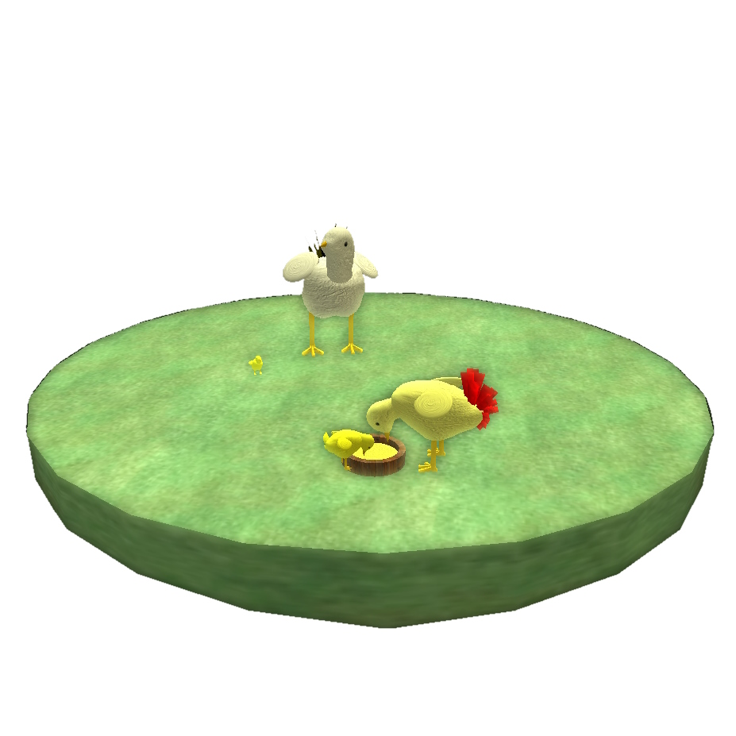
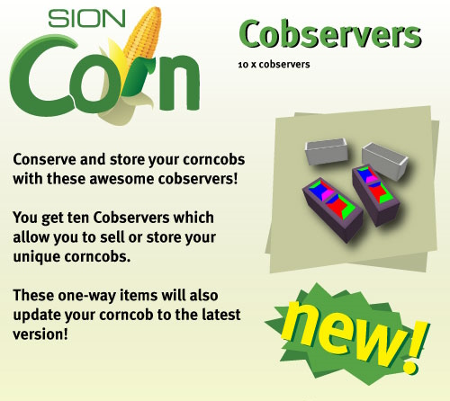

# sionChicken Project Overview
#### created by Richard Bogad (c) 2008

  
  

## The Market Gap in SecondLife
In Second Life, users trade goods through a basic permission system that involves copying, transferring, and modifying items. 
However, it was challenging to create self-replicating objects that couldn't be cloned by users.

## Idea
The goal was to develop a method for automatic and secure data/object transfer between an object and its copies, laying the groundwork for the creation of lifelike creatures.
## Innovation & Project Strategy
- Introduced a novel technique for breeding 'curious chickens'.
- Equipped lifeforms with AI for complex behaviour to enhance user/object interaction.
- Developed pathfinding algorithms for 3D environment navigation.
- Implemented 'genetic traits' inheritance to engage collectors and breeders.
- Mimicked natural ecosystem: Lifeforms require user-provided food and care.

## Impact
The project sparked a boom, followed by 26 teams, creating the still-thriving 'Breedables' market.

  

## sionCorn
An additional product simulating corn cultivation with randomly iterative growth algorithms. The harvested corn feeds the sionChickens.

## Recognition
Linden Labs / Second Life nominated sionChicken for the 2010 Linden Prize. Users bred and auctioned unique varieties, positively impacting the SL economy.

## Challenges
Limitations of the Second Life scripting language LSL, exclusive owner rights, and the mysterious proliferation of products in SL presented obstacles.
These limitations led to the development of sionLife.

## sionLife
The continuation project 'sionLife' (not included in this repository ) had the following features:
* Integrated artificial intelligence and 3D pathfinding for realistic creature behavior.
* Developed a complex reproductive system echoing natural genetics.
* The use of dynamic 3D mesh generation algorithms accurate visuals.
* Incorporated a 3D printing feature through i.Materialize for tangible virtual creations.
* Stimulated the ecosystem by providing an auction system for lifeforms.
* Utilized Google App Engine (Java) cloud services for effective scalability.

More about sionLife can be found [here](https://github.com/richardbogad/sionLife/).

## Project sionChicken Impressions

  
  
  

  
  
  
  

  
  
  
  

  
  
  
  

  
  
  
  

### Links & References
* [O'ReillyTV, "THE PLIGHT OF THE DIGITAL CHICKEN by Patrick Davison"](https://www.youtube.com/watch?v=3p5d4e5e-7o)
* [New World Notes, "Virtual Chickens (Briefly) Added 60K Paying Users To Second Life's Economy"](https://nwn.blogs.com/nwn/2010/04/sion-chicken-explosion.html)
* [2010 Linden Prize Finalist: SionChicken](https://www.youtube.com/watch?v=q6pZhkWIphA)

### Play Guide
The play guide for the sionChicken Project can be found [here](https://github.com/richardbogad/sionChicken/PLAYGUIDE.md).

### License

sionChicken © 2009 by Richard Bogad is licensed under CC BY-NC-SA 4.0.
To view a copy of this license, visit http://creativecommons.org/licenses/by-nc-sa/4.0/ or [CC BY-NC-SA 4.0](license.txt)

### Code
The code for the latest version v12 of the sionChicken Project can be found [here](https://github.com/richardbogad/sionChicken/CODE.md). 
